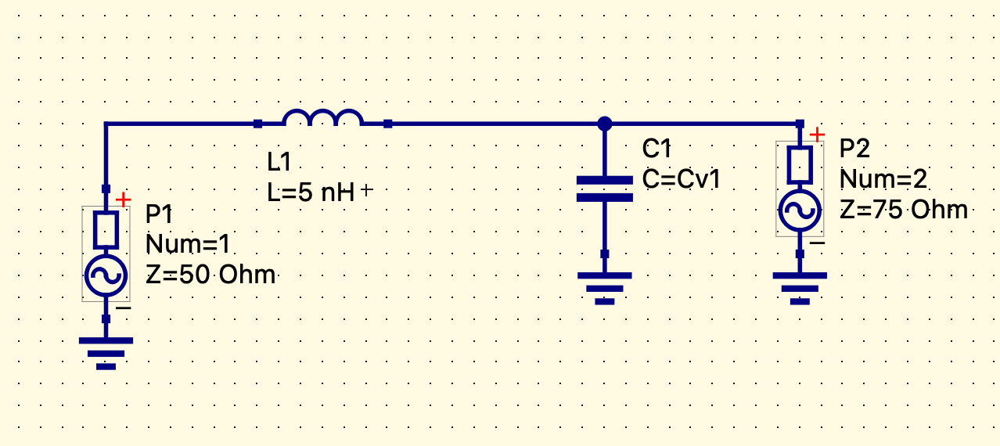
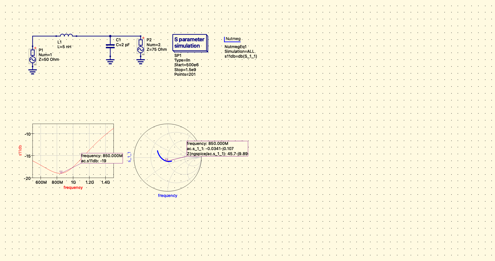
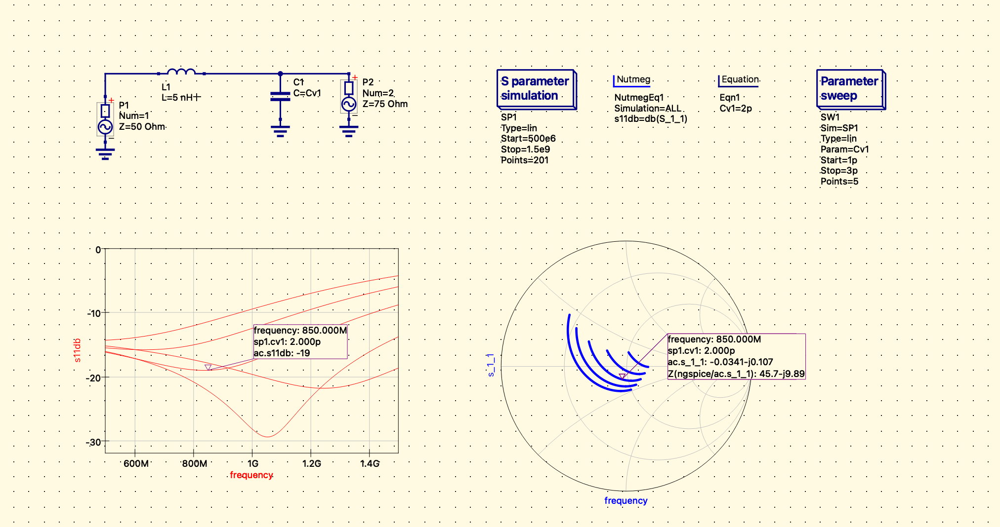

# Qucs-S-RF-Matching-850MHz
Design and simulation of a Lumped Element L-Section Matching Network (50Ω to 75Ω) at 850 MHz using Qucs-S and Ngspice. Includes parameter sweep and sensitivity analysis.

# RF Impedance Matching Network (850 MHz)

  

## Project Overview
This project demonstrates the design, simulation, and optimization of a **Lumped Element L-Section Matching Network**. The objective is to match a **50Ω Source** to a **75Ω Load** at a center frequency of **850 MHz**, minimizing reflections and maximizing power transfer.

The design was simulated using **Qucs-S** with the **Ngspice** backend, utilizing advanced analysis techniques including S-Parameter simulation and Parameter Sweeps for sensitivity analysis.

## Design Specifications
* **Target Frequency ($f_0$):** 850 MHz
* **Source Impedance ($Z_S$):** $50\Omega$
* **Load Impedance ($Z_L$):** $75\Omega$
* **Topology:** Low-Pass L-Network (Series Inductor, Shunt Capacitor)
* **Calculated Values:**
    * Inductor ($L_1$): $5 \text{ nH}$
    * Capacitor ($C_1$): $2 \text{ pF}$

---

## Simulation Results

### 1. Circuit Schematic
The matching network consists of a series inductor placed between the source and load, with a shunt capacitor on the load side.

### 2. Performance Analysis (S-Parameters & Smith Chart)
At the design frequency of **850 MHz**, the circuit achieves excellent matching characteristics.

* **Return Loss ($S_{11}$):** $\approx -19 \text{ dB}$ (Indicates <2% reflected power)
* **Impedance Match:** The impedance at port 1 is transformed to **$45.7 - j9.89 \Omega$**, which is very close to the ideal $50\Omega$ point on the Smith Chart center.

---

## Optimization & Tuning Strategy

To account for component tolerances and verify the design robustness, a **Parameter Sweep** analysis was performed on the capacitor ($C_1$).

### Sensitivity Analysis
* **Sweep Range:** $C_1$ varied from **1.0 pF to 3.0 pF**.
* **Observation:** As capacitance decreases, the resonance frequency shifts higher. As capacitance increases, the resonance shifts lower.
* **Optimal Point:** The sweep confirms that **2.0 pF** yields the deepest resonance at exactly **850 MHz**.

*(Figure: Parameter sweep of C1 showing frequency shift. The marker indicates the optimal performance at 2.0 pF)*

---

## Tools & Methods Used
* **Schematic Capture:** Qucs-S
* **Simulation Engine:** Ngspice
* **Analysis Types:**
    * AC Simulation (S-Parameters)
    * Nutmeg Scripting (for dB calculation: `let s11db = db(S_1_1)`)
    * Parameter Sweep (Optimization)

## How to Run
1.  Clone the repository.
2.  Open `Impedance_Matching_Design.sch` in **Qucs-S**.
3.  Ensure **Ngspice** is installed and configured as the backend.
4.  Press **F2** to simulate.

---
